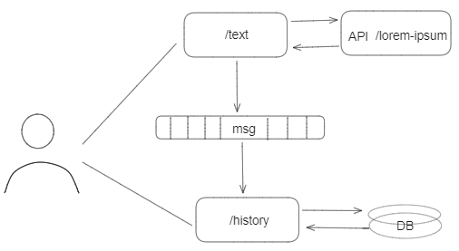

# BetVictor Text Processing System

<h2><u>Text Processing Microservice</u></h2>
This project comprises two microservices designed to demonstrate text processing and inter-service communication using
Kafka for message passing. The system fetches and processes text data from the Lorem Ipsum API, computes various
statistics, and then stores and displays the results.

## Architecture

The system consists of two main applications:

1. **Text Processing Application**: Responsible for fetching text from the Lorem Ipsum API, computing text statistics,
   and
   producing results to a Kafka topic.
2. **History Microservice**: Consumes messages from the Kafka topic and stores the results in a database. More details
   can be found in its [repository](https://github.com/Artem3/betvictor-history-microservicevice).



### Processing Application

- **Endpoint URL**: `/betvictor/text`
- **Method**: HTTP GET
- **Parameters**:
    - `p`: Max number of paragraphs (>0)
    - `l`: Length of each paragraph (short, medium, long, verylong)
- **Functionality**:
    - Makes requests to the Lorem Ipsum API to fetch text.
    - Analyzes the text to determine the most frequent word, average paragraph size, average and total processing times.
    - Produces results to the Kafka topic `words.processed`.

### Response Fields Explained

Upon processing, the service generates a JSON response with the following fields:

- **`freq_word`**: The word that appears most frequently in the text.
- **`avg_paragraph_size`**: The average number of words per paragraph.
- **`avg_paragraph_processing_time`**: The average time taken to analyze each paragraph, measured in micro/nano-seconds.
- **`total_processing_time`**: The total time taken to process the entire request.

This data helps in understanding the textual complexity and processing efficiency.

## Technologies

- **Java**: Main programming language, version 17.
- **Spring Boot**: Framework for creating REST API and Kafka consumers/producers, version 3.2.4.
- **Kafka**: Messaging system for producing and consuming messages. `wurstmeister/kafka`
- **Docker**: It is expected that you have Docker installed to work with `docker-compose.yml`.

## Usage

Making a request to the Processing application:

```bash
curl -X GET "http://localhost:8081/betvictor/text?p=3&l=short"
```

Example JSON Response:

```json
{
  "freq_word": "et",
  "avg_paragraph_size": 58.4,
  "avg_paragraph_processing_time": "111μs 542ns",
  "total_processing_time": "101ms 549μs"
}
```

